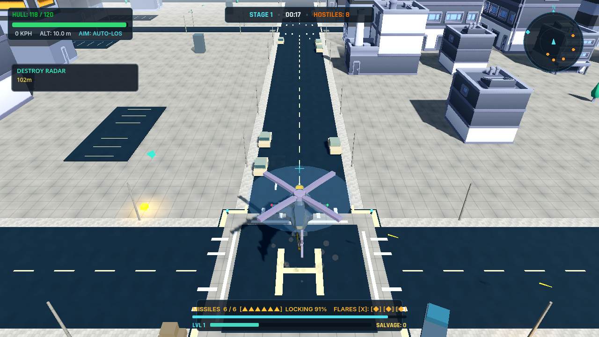

# URBAN STRIKE // HELI-STRIKE ROGUE

A 3D arcade helicopter combat roguelike built in **Godot 4.7.2** with the **Compatibility (OpenGL 3)** renderer.

Combines the tactical flight maneuverability and mission structure of classic Strike games (*Desert Strike*, *Jungle Strike*, *Urban Strike*) with modern continuous horde survival pressure (*Vampire Survivors*, *Megabonk*).

<p align="center">
  
  <br>
  <em>Tactical surveillance and combat over the 340m modular urban operations theater with Kenney 3D road networks, dynamic shadows, and combat HUD.</em>
</p>

---

## 📸 Gameplay Showcase

### 🚁 Tactical Flight & High-Speed Combat
Combat in *Urban Strike* merges momentum-based flight dynamics with high-intensity arcade dogfighting and strafing runs.

| High-Speed Avenue Strafing (137 KPH) | Kinetic Chaingun & Rocket Saturation |
| :---: | :---: |
|  |  |
| *Locking onto armored vehicles and infantry clusters at low altitude* | *Autocannon tracers, impact smoke, and missile lock engagement* |

### 🏙️ Modular Urban Districts & Kenney 3D Road Networks
The expanded 340m × 340m operations theater features high-rise skyscrapers, industrial depots, military revetments, and modular Kenney road tiles with intersections, road markings, curbs, trees, and street furniture.

| Urban Canyon Maneuvering | Helipad Operations & Road Infrastructure |
| :---: | :---: |
|  |  |
| *Precision flight between commercial skyscrapers and industrial plants* | *Operational LZ deployment, rotor wash, and Kenney road network* |

### ⚡ Roguelike Synergies & Hangar Meta-Progression
Survive continuous procedural hordes, gather magnetized XP gems, and build game-breaking weapon synergies with mid-run upgrade cards and persistent hangar retrofits.

| In-Run 3-Card Tactical Upgrades | Tactical Hangar & Retrofit Systems |
| :---: | :---: |
|  |  |
| *Build-altering weapon synergies, escort drones, and flight trade-offs* | *Banked salvage investment for permanent airframe upgrades* |

---

## 🎮 Core Features

### 🚁 Helicopter Combat & Flight Dynamics
- **Physics-Driven Flight**: Full momentum, banking turns, rotor torque, collective altitude management, and collision responsiveness.
- **Weapon Suite**:
  - **High-Velocity Chaingun**: Rapid-fire kinetic autocannon with realistic heat buildup and overheat lockout.
  - **Hydra 70 Rockets**: Unguided saturation artillery for sweeping infantry and vehicle clusters.
  - **AGM-114 Hellfire Missiles**: Wire/laser-guided anti-armor munitions with target lock-on.
  - **Flare Countermeasure Dispenser**: Anti-missile defense flares decoy incoming SAM and enemy heatseekers.
- **Targeting System**: 360-degree omnidirectional target acquisition with predictive lead calculation, priority stickiness, and line-of-sight tracking.

### 🏙️ Urban Strike Combat City & Modular Districts
Expansive 340m $\times$ 340m urban operations theater divided into 4 tactical zones:
1. **City Center**: Commercial skyscrapers, mid-rise office complexes, civic plazas, and elevated AA roof emplacements.
2. **Industrial District**: Heavy logistics warehouses, container yards, parking depots, and destructible fuel tanks.
3. **Military District**: Aircraft hangars, early-warning radar arrays, fortified SAM revetments, and security checkpoints.
4. **Outskirts**: Open terrain, dirt roads, scattered structures, and natural perimeter approaches.
- **Kenney 3D Road Tiles Integration**: Modular multi-lane avenues, 4-way cross intersections, straight thoroughfares, curbs, realistic road markings, streetlamps, pine trees, and parked civilian vehicles.

### 🛑 3-Tier Playable Area Boundary
- **Inner Safe Area ($\pm 125\text{m}$)**: Free-flight tactical maneuvering zone.
- **Warning Border ($125\text{m} - 145\text{m}$)**: HUD tactical warning banner (`RETURN TO COMBAT AREA`), dynamic distance readout, and subtle aerodynamic inward resistance.
- **Hard Boundary ($148\text{m}$)**: Physical boundary barrier and smooth kinematic velocity clamp that prevents outward clipping.

### 💥 Destructible Environment
- **Industrial Fuel Tanks**: Take weapon damage, emit warning smoke at 50% HP, and detonate with a massive 14m AoE explosion (85 damage to hostiles) and bonus salvage drops.
- **Destructible Props**: Military logistics crates and barriers destructible by chaingun or rockets.

### 👾 Continuous Procedural Horde Spawning (No Waves)
- **Zero-Starvation Spawning**: Enemies continuously enter the battlefield from road corridors, perimeter gates, and air corridors. Spawning never waits for enemy counts to reach zero.
- **Threat Director**: Dynamic urgency scaling based on player survival time, threat budget replenishment, and escalating composition tiers.
- **Enemy Ecosystem**:
  - **Infantry Clusters**: Urban infantry squads with RPGs and small-arms fire.
  - **Battle Tanks**: Heavy armored mobile artillery.
  - **SAM Missile Sites**: Radar-guided surface-to-air missile batteries.
  - **Air Scouts**: Fast agile reconnaissance helicopters.
  - **Hunter Gunships**: Aggressive air-to-air attack helicopters.
  - **Electronic Warfare Jammers**: Disrupt player radar and missile locks.
  - **Reinforcement Transports**: Air-drop ground troops into active sectors.
  - **Boss Archon**: Multi-phase heavy gunship flagship encounter.

### ⚡ Rapid XP Vacuum & Progression
- **High-Speed XP Magnet**: Instant Area3D detection with 3D player velocity compensation, preventing the helicopter from outrunning gems at maximum flight speed.
- **In-Run Level Ups**: Pick up XP gems to choose build-altering weapon synergies, fire rates, damage increases, and defensive countermeasure evolutions.
- **Support Wingmen Power-Up**: Deploy autonomous escort aircraft with independent damage interception, tactical weapon fire, and in-run restoration.
- **Combat Feedback Hierarchy**: Exact accepted-damage popups (excluding overkill), cyan electric shield sparks vs. kinetic metal sparks, dynamic laser aiming telegraphs, enemy death spins, and off-screen HUD threat tracking.
- **Hangar Meta-Progression**: Bank collected salvage across runs to permanently upgrade Hull Armor, Engine Thrust, Weapon Capacities, and Magnet Reach.

---

## 🕹️ Controls

| Action | Keyboard & Mouse | Gamepad |
| :--- | :--- | :--- |
| **Throttle / Pitch** | `W` / `S` | Left Stick (Y-Axis) |
| **Turn / Yaw** | `A` / `D` | Left Stick (X-Axis) |
| **Strafe (Roll)** | `Q` / `E` | `L1` / `R1` (Bumpers) |
| **Ascend / Descend** | `Space` / `Shift` or `C` | `A` / `B` (Buttons 0/1) |
| **Primary Fire (Chaingun)** | Left Mouse Button | Right Trigger (`RT`) |
| **Secondary Fire (Missiles)** | `F` | `X` (Button 2) |
| **Deploy Flares** | `X` | `Y` (Button 3) |
| **Aim Override / Manual Aim** | Right Mouse Button | Right Stick |
| **Toggle Debug Overlay** | `F3` or `~` | — |
| **Pause Game** | `Escape` | `Start` (Button 6) |

---

## 🏗️ Project Architecture

```text
res://
├── docs/                    # Documentation and media
│   ├── images/              # High-resolution in-engine gameplay screenshots
│   └── kenney-environment.md# Modular environment & road tile specifications
├── scenes/
│   ├── battlefield/         # Main combat theater (battlefield.tscn)
│   ├── camera/              # Tactical follow camera rig (camera_rig.tscn)
│   ├── enemies/             # Enemy scenes (infantry, tanks, SAMs, air gunships, boss)
│   ├── environment/         # Modular city, military, road, and prop scenes
│   │   ├── boundary/        # 3-tier boundary controller (playable_area.tscn)
│   │   ├── city/            # Buildings, warehouses, plazas, parking lots
│   │   ├── military/        # Hangars, checkpoints, radar, SAM revetments
│   │   ├── props/           # Destructible fuel tanks, crates, barriers, fences
│   │   └── roads/           # Intersections, straights, corner avenues (Kenney 3D Tiles)
│   ├── hangar/              # Meta-progression hangar shop (hangar.tscn)
│   ├── menu/                # Main menu with 3D backdrop (main_menu.tscn)
│   ├── pickups/             # XP gems and salvage crates
│   ├── player/              # Player helicopter controller (player_helicopter.tscn)
│   ├── spawners/            # Procedural spawn system (spawn_system.tscn)
│   ├── tests/               # Headless automated test runner (test_runner.tscn)
│   └── ui/                  # HUD, level up menu, pause menu, death screen
├── scripts/
│   ├── camera/              # Camera tracking, smoothing, and screen shake
│   ├── common/              # EventBus, GameManager, SaveSystem, EnemyRegistry
│   ├── directors/           # SpawnDirector and CombatDirector
│   ├── enemies/             # Ground and air enemy AI controllers
│   ├── environment/         # Playable area, fuel tanks, destructible props
│   ├── player/              # Helicopter flight physics, weapons, and targeting
│   └── tests/               # 22 automated test suites (test_runner.gd)
└── resources/               # Wave definitions and weapon data tables
```

---

## 🧪 Testing & Verification

The project includes an automated headless test runner covering **22 test suites**:
1. Player flight physics & modular nodes
2. Chaingun 11.5 RPS & 2.5s overheat lockout
3. Guided Missiles & Flare Countermeasures
4. UpgradeManager & Weapon Evolutions
5. Enemy Roster: Infantry, Tank, SAM, Hunter, Radar
6. Archon Heavy Gunship 3-Phase Boss
7. CombatDirector & SpawnDirector tables
8. SaveSystem & Hangar Persistence
9. Targeting Stickiness, Hysteresis & Mission Priority
10. Battlefield Formations, Radar Consequences & Escort Scatter
11. 3-Tier Reward Hierarchy & Build-Changing Weapon Synergies
12. Spatial EnemyRegistry, Object Pooling & Distance AI LOD
13. Accessibility Deadzones & Combat Telemetry Tracking
14. Air Enemy Ecosystem: 6 Modular Archetypes
15. Threat Director Procedural Air Formations & Active Caps
16. Jammer Electronic Warfare & Targeting Integration
17. Transport Helicopter Ground Force Deployment
18. Continuous Horde Survival Director
19. 360-degree Omnidirectional Auto-Aim & Auto-Fire
20. Predictive Lead Aiming Calculation
21. Continuous Spawning Targets & High-Speed XP Magnet Responsiveness
22. Environment Districts, Destructible Props & 3-Tier Boundary System

### Running Tests
Execute from the project root using Godot CLI:
```bash
godot --headless --path . --scene res://scenes/tests/test_runner.tscn
```

---

## 📋 Further Documentation
- [`WALKTHROUGH.md`](WALKTHROUGH.md): Milestone logs, root-cause analyses, and verification benchmarks.
- [`IMPLEMENTATION_PLAN.md`](IMPLEMENTATION_PLAN.md): Technical architecture and modular city environment specifications.
- [`HELI-STRIKE_CORE_GAMEPLAY_GDD.md`](HELI-STRIKE_CORE_GAMEPLAY_GDD.md): Core game design document.
- [`ROGUELIKE_GAMEPLAY_REAUDIT.md`](ROGUELIKE_GAMEPLAY_REAUDIT.md): Roguelike pacing and meta-progression audit.