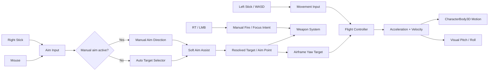
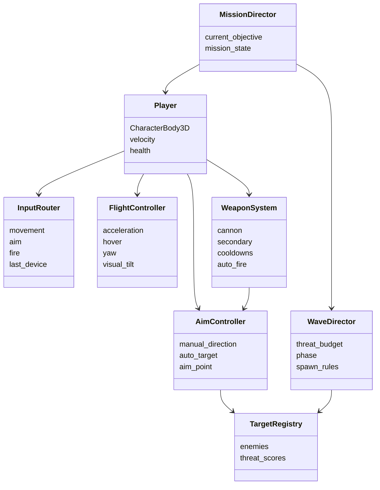
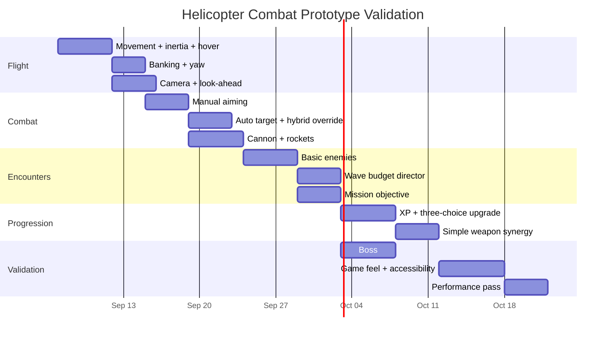

# Physics-Based Arcade Helicopter Controls and Godot Prototype for 2026

## Executive summary

Your strongest direction is **not** to make the right stick directly control helicopter roll/tilt. The cleanest modern control model is to separate three concepts that older helicopter games often blended together:

**movement** → where the helicopter travels  
**aiming** → where weapons want to point  
**airframe animation/physics response** → how the helicopter banks, pitches, and yaws to make that movement look physical

That separation is the solution to the concern you raised about the right stick feeling awkward.

> **Recommended control rule:**  
> **Left stick / WASD moves the helicopter. Right stick / mouse aims. Acceleration creates pitch and roll automatically. The right stick never directly commands roll or pitch.**

The helicopter can still gradually yaw toward the aim direction so it looks believable, but the gun/turret should be able to lead the nose within an aiming arc. This allows you to circle-strafe, move backward while firing forward, and dodge laterally without the helicopter suddenly leaning in the wrong direction.

This recommendation deliberately modernizes rather than copies the older references. *Nuclear Strike* used digital directional movement, weapon buttons and a dedicated jink/strafe concept rather than modern twin-stick aiming; even the Nintendo 64 version was criticized for not making full use of analog control. *Army Men: Air Attack 2*, meanwhile, supported left-analog multidirectional movement with shoulder-button strafing, and contemporary reviews specifically praised its controls as tight and responsive. citeturn13search0turn13search4turn1search7

For your larger project, the uploaded design brief establishes a commercial indie concept mixing Strike-style helicopter missions, wave survival, procedural encounters, build crafting, roguelite progression and modernized PS1 presentation. fileciteturn0file0 My recommendation is to **keep the Strike-style mission layer as the identity and borrow the power escalation, upgrade drafting and encounter pacing of survivor-likes rather than turning the game into another pure survivor-like.**

The strongest shooting model is therefore **Variant D: hybrid auto-fire with manual override**:

**Controller**
- Left stick: camera-relative planar movement.
- Right stick: weapon aim and manual target authority.
- Primary cannon: automatically engages appropriate targets when auto-fire is enabled.
- Right trigger: manual/focus-fire override.
- Left trigger: precision aim / soft lock.
- Secondary missiles and rockets: mostly manual.
- Helicopter roll/pitch: generated automatically from acceleration.
- Helicopter yaw: follows aim or movement at a capped physical-looking rate.

**Keyboard and mouse**
- WASD: movement.
- Mouse: world-space aim cursor.
- LMB: manual/focus primary fire.
- RMB: secondary weapon.
- Shift: precision/soft lock.
- Space: jink/boost.
- Same auto-cannon option as controller.

This solves two different ergonomics problems. Mouse pointing is intrinsically more precise than thumbstick pointing: a Fitts' Law experiment found mouse throughput of 4.73 bits/s versus 2.39 bits/s for a thumbstick, although that experiment was small and was a generic pointing task rather than this exact game. A 2026 study using real Halo player data likewise found a mouse-and-keyboard performance advantage despite controller aim assistance, though FPS competition is not directly equivalent to a single-player arcade helicopter game. citeturn20search2turn20search8 Consequently, **controller aim should receive assistance instead of trying to imitate mouse precision one-to-one**.

Auto-fire also removes unnecessary repetitive button work. A 2024 ergonomics study found increased forearm-muscle activation during an hour-long repetitive mouse-clicking protocol; that does not prove auto-fire is healthier in games generally, but it is another reason not to require players to mash fire several times per second when a cannon can simply continue firing while held or automatically engage targets. citeturn20search0turn20search5

For gameplay structure, I recommend:

> **Mission-driven helicopter action + dynamic waves + roguelite build escalation**, rather than a pure Vampire Survivors clone.

There is contemporary evidence that objectives and survivor mechanics can coexist. *Deep Rock Galactic: Survivor* explicitly combines auto-shooting, enemy waves, procedural levels, mission objectives and extraction; its Steam page currently shows roughly 24,000 English reviews with an 87% positive rating. citeturn17search0 *Megabonk*, released in September 2025, demonstrates continued demand for 3D survivor-style escalation and large build/quest systems, while *Vampire Survivors* remains an exceptionally positively reviewed benchmark for the auto-shooter structure. citeturn8search0turn8search2 These figures establish market reception, **not retention rates**.

**No reliable public D1/D7/D30 retention data was found for these comparable premium games.** Accordingly, the retention estimates later in this report are design forecasts rather than invented statistics.

For the technology stack, **Godot 4.7.2 is the latest stable Godot 4.x release as of September 6, 2026**, released August 18, while 4.8 is still in development snapshots. Godot itself describes 4.7.2 as its second 4.7 maintenance release and recommends upgrading from 4.7.1. citeturn22search0turn22search1turn22search2

For the player body, I recommend **CharacterBody3D rather than RigidBody3D**. It sounds counterintuitive for a "physics-based" helicopter, but it gives you the better arcade result. CharacterBody3D is specifically intended for user-controlled bodies and lets you implement acceleration, inertia, drag, terrain-following hover, knockback and collisions deterministically; Godot's floating motion mode is explicitly suited to bodies without a floor/ceiling concept. citeturn15view0 A RigidBody3D is genuinely force-simulated, but Godot warns against frequently setting its transform or velocity and expects force-based control or `_integrate_forces()`, which adds tuning complexity and makes the exact responsiveness you need harder to guarantee. citeturn16view0turn16view1

The result should be **physics-informed arcade flight**, not a simulation.

**My recommended elevator pitch for the control/gameplay combination is:**

> **Move like an arcade twin-stick shooter, bank like a helicopter, aim like a modern action game, and fight through Strike-style battlefield objectives while your weapons evolve into increasingly ridiculous combat builds.**

## Evidence and design context

The most important lesson from *Nuclear Strike* and *Army Men: Air Attack 2* is not that you should reproduce their exact button layout. Their value is the combination of **battlefield visibility, multidirectional vehicle movement, readable missions and uncomplicated helicopter fantasy**.

*Nuclear Strike* mapped movement separately from guns, missiles, rockets, target functions and jink actions; the N64 version still lacked true analog control, according to contemporary coverage. citeturn13search0turn13search4 *Air Attack 2* moved the helicopter with directional/analog input, used shoulder buttons for strafing and face buttons for weapon/winch functions; GameSpot praised the responsiveness and also highlighted mission variety such as defense, rescue, theft and demolition. citeturn1search0turn1search7

That history suggests a useful principle:

**Verified fact:** the older games got away with relatively simple aiming because enemy counts, weapon behavior, camera framing and targeting assistance were designed around those controls. citeturn13search0turn1search7

**Design inference:** transplanting those exact controls into a 2026 game with denser enemy waves, upgrade-induced projectile spam and high-speed movement would increase targeting workload dramatically.

**Recommendation:** borrow their *camera readability, battlefield navigation, strafing freedom and objective-oriented combat*, while adopting a modern dual-axis input model.

There is also a real PC audience for controller-first design. Valve's published Steam figures reported controller use rising from roughly 5% of sessions in 2018 to as much as 15% in 2024; around 42% of those controller sessions used Steam Input, with Xbox controllers representing 59%, PlayStation controllers 26% and Steam Deck 10% at the time. citeturn19search5 That metric is from Valve's 2024 publication rather than a new 2026 census, but it is sufficient evidence that controller support should be a first-class PC feature rather than an afterthought.

At the same time, input parity does **not** mean identical physical demands. The mouse is substantially better at fine pointing than an analog thumbstick in controlled testing, which is why controller users benefit from target magnetism, sticky targeting, larger acquisition cones and response curves. citeturn20search2turn20search8 Your game is single-player, so there is no competitive reason to deny one device intelligent assistance merely to make two very different devices mechanically identical.

Accessibility standards reinforce this direction. Microsoft's current accessibility guidance treats comprehensive input remapping, digital alternatives and keyboard-only operation as important accessibility capabilities; Microsoft's broader controller guidance also recommends configurable analog sensitivity and supports one-stick alternatives for players unable to operate two sticks simultaneously. citeturn17search12turn10search0turn10search12turn10search13

### What "physics based" should mean here

For this project, "physics based" should mean:

**Input → desired acceleration → velocity → position**

rather than:

**Input → instantly set position**

and it should mean:

**acceleration → visible pitch/roll**

rather than:

**right stick → pitch/roll directly**

That produces weight without simulation overhead.

A helicopter should take perhaps 0.4–0.7 seconds to reach most of its commanded speed, should continue drifting slightly when the stick is released, should bank during lateral acceleration, and should pitch during forward acceleration. It should nevertheless stop considerably faster than a real helicopter because this is an action game.

The important separation is:

```text
PLAYER COMMAND
     │
     ├── Left stick / WASD ─────────────► TRANSLATIONAL ACCELERATION
     │                                     │
     │                                     ├──► velocity
     │                                     └──► visual pitch / roll
     │
     └── Right stick / mouse ────────────► AIM DIRECTION
                                           │
                                           ├──► turret / reticle
                                           ├──► target assist
                                           └──► gradual airframe yaw
```

**The right stick does not drive roll or pitch.**

That one architectural rule removes most of the "weird helicopter tilt" problem you were worried about.

## Control ergonomics and mappings

### Comparison of the four control approaches

The scores below are **design evaluations**, not measured user-retention statistics. Five is best; for fatigue, five means lowest expected workload.

| Variant | Basic behavior | Accessibility | Precision | Learning | Low fatigue | High-density combat | Main advantage | Main problem |
|---|---|---:|---:|---:|---:|---:|---|---|
| **A — Dual-stick manual aim** | LS moves, RS aims, trigger fires | 3/5 | 3.5/5 | 4/5 | 3/5 | 3/5 | Maximum combat agency | Constant right-stick + trigger workload |
| **B — Movement + mouse aim** | WASD/LS moves, mouse points | 3.5/5 | 5/5 | 4.5/5 | 3.5/5 | 4.5/5 | Fastest target acquisition | Cannot be your universal controller scheme |
| **C — Auto-shoot + directional facing** | Player mainly moves; game selects/fires | 5/5 | 2/5 | 5/5 | 5/5 | 5/5 | Extremely approachable | Target-priority decisions become weak |
| **D — Hybrid auto + manual override** | Auto handles routine fire; RS/mouse instantly takes authority | **4.5/5** | **4.5/5** | **4.5/5** | **4.5/5** | **5/5** | Accessibility without removing mastery | Requires good target-selection tuning |

### Variant A — dual-stick manual aim

This is the familiar twin-stick solution.

Left stick controls translation in the camera plane. Right stick gives an aim vector. The helicopter can move east while firing north, for example.

The advantage is extremely clear agency: when the player misses, the reason is understandable. It also suits deliberate Strike-style objectives where the player wants to destroy the radar vehicle before the tank beside it.

The weakness appears when the game becomes a survivor-like. Imagine maintaining evasive left-stick movement while continuously pushing the right stick toward different enemies, holding RT, watching missiles, reading objective UI, selecting upgrades and monitoring cooldowns. Individually each action is easy; collectively the combat can become busy.

Thumbstick pointing also has inherently lower fine-target acquisition performance than mouse pointing in controlled research, making a raw, unassisted dual-stick implementation especially unfriendly to casual controller users. citeturn20search2

**Verdict:** excellent optional "Manual Gunner" mode; not my recommended default.

### Variant B — movement plus mouse aim

For normal PC use this means **WASD + mouse**, and it is likely to be your highest-precision profile. Mouse screen position maps naturally onto a world-space point, which is particularly effective with a high, angled camera.

A literal **left gamepad stick + mouse** split-device setup can technically work, and some accessibility/specialized setups use mixed input, but I would not make it a primary layout. It physically requires two separate devices and complicates prompts.

Mouse aim should be direct:

```text
screen cursor
      ↓
camera ray
      ↓
terrain/world intersection
      ↓
weapon aim point
```

Do not make players steer an artificial virtual cursor with mouse delta unless there is a very specific aesthetic reason. Absolute screen-to-world aiming is the easier mental model for this camera style.

**Verdict:** primary keyboard/mouse mapping; not a universal gamepad solution.

### Variant C — full auto-shoot

This has tremendous accessibility and is proven in modern survivor-likes. *Deep Rock Galactic: Survivor* explicitly describes a design in which players need not aim or fire and can instead concentrate on movement, mining, enemy waves and objectives. citeturn17search0 *Vampire Survivors* likewise demonstrates the appeal of concentrating player attention on movement, positioning and build decisions while weapons handle most firing behavior. citeturn8search2

The problem for **your** concept is identity.

Destroying:

- the SAM launcher before it obtains a lock,
- the radar truck buffing several SAMs,
- the artillery vehicle shelling friendlies,
- the convoy command vehicle,
- a boss weak point,

is far more interesting when the player can intentionally decide *what dies first*.

Full auto-targeting tends to turn that tactical decision into "move until the algorithm eventually shoots the important thing."

**Verdict:** ideal accessibility mode and useful for some weapons; too passive as the entire combat system.

### Variant D — hybrid auto-fire with manual authority

This is the strongest solution.

The primary cannon has an intelligent default target. The player can therefore concentrate on flying during routine engagements.

As soon as right-stick input exceeds a threshold, or the mouse points elsewhere, the game yields targeting authority to the player.

Holding RT/LMB becomes **focus fire**:

> "Ignore what your targeting computer wants. Shoot where I am telling you."

This means the control layers are:

```text
NO MANUAL AIM
    ↓
targeting computer selects useful enemy
    ↓
cannon auto-engages

RIGHT STICK / MOUSE INPUT
    ↓
player aim overrides targeting computer
    ↓
soft assist searches near intended direction
    ↓
player target receives priority

RT / LMB
    ↓
force manual firing, including scenery / empty locations
```

Missiles, rockets, bombs, orbital strikes and other expensive attacks should generally remain manually triggered. That preserves player agency and resource decisions even when the cannon is automated.

**This is my primary recommendation.**

### Why aiming will not make the helicopter tilt strangely

Do **not** calculate the helicopter's bank from the aim stick.

Calculate it from movement acceleration:

\[
Roll_{target} = -Input_{lateral} \times Roll_{max}
\]

\[
Pitch_{target} = Input_{forward} \times Pitch_{max}
\]

Then smooth both values.

Right-stick aim only influences yaw:

\[
Yaw_{desired} = atan2(AimDirection)
\]

and even that turns at a limited speed.

This produces cases like:

**Move right + aim left**

The helicopter banks right because it is accelerating right. Its nose gradually yaws left. Its cannon can already fire left before the full airframe finishes rotating.

That looks far more natural than banking left simply because the player moved the crosshair left.

### Recommended mapping

| Action | Gamepad | Keyboard + mouse | One-stick/accessibility |
|---|---|---|---|
| Movement | Left stick | WASD / arrows | Left stick |
| Aim | Right stick | Mouse cursor | Auto-target / facing direction |
| Primary focus fire | RT | LMB | RT / chosen button |
| Precision / soft lock | LT | Left Shift | Optional toggle |
| Secondary fire | RB | RMB | Face button |
| Change secondary | Y | Q / mouse wheel | D-pad |
| Jink / boost | A | Space | Remappable |
| Flares / defense | B | F | Remappable |
| Interact / rescue / winch | X | E | Remappable |
| Cycle target | D-pad right/left | Tab / wheel | Optional |
| Auto-fire toggle | Settings + optional D-pad bind | Settings + optional key | Enabled by default |
| Pause | Menu | Esc | Menu |

I would **not** put essential combat functions on L3/R3 stick clicks. Microsoft's accessibility guidance specifically emphasizes remapping and alternatives for difficult control inputs, and avoiding mandatory stick clicks simplifies accessibility work. citeturn10search13

### Starting input values

These are **prototype starting values**, not universal standards. You should expect to modify them after controller testing.

| Parameter | Recommended default | User range | Reason |
|---|---:|---:|---|
| Movement inner deadzone | **0.15** | 0.05–0.30 | Prevent drift without losing fine movement |
| Aim inner deadzone | **0.12** | 0.05–0.30 | Aim benefits from slightly finer response |
| Aim manual-override threshold | **0.24** | 0.15–0.40 | Prevent tiny stick drift stealing auto-target |
| Outer deadzone | **0.98** | 0.90–1.00 | Ensures older sticks can reach full output |
| Movement response exponent | **1.25** | 1.0–2.0 | Fine low-speed control |
| Aim magnitude exponent | **1.45** | 1.0–2.2 | More precision near center |
| Airframe yaw rate | **200°/s** | 120–300°/s | Responsive but visibly physical |
| Controller aim smoothing | **0.06–0.10 s** | 0–0.25 s | Removes jitter without heavy latency |
| Mouse aim smoothing | **Off** | 0–0.15 s | Mouse should remain direct |
| Soft-lock cone | **18°** | 0–35° | Helps controller acquisition |
| Strong missile lock cone | **30–35°** | weapon-specific | Preserves positioning |
| Target stickiness | **0.20 s** | 0–0.5 s | Stops rapid enemy hopping |
| Aim-assist strength | **35%** | 0–100% | Meaningful but not overpowering |
| Camera FOV | **50°** | 42–65° | Battlefield view without extreme distortion |
| Camera shake | **60%** | 0–100% | Accessible reduction available |
| Vibration | **70%** | 0–100% | Player-controlled |

Godot itself notes that analog devices require deadzones because physical sticks can report small nonzero values at rest. Its documentation uses `Input.get_vector()` specifically because it handles two-axis circular deadzones correctly; Godot's default action deadzone is 0.5, which is substantially larger than I would use for a precise action game, and the documentation itself gives 0.2 as an illustrative deadzone. citeturn16view2turn16view3

Because we want custom inner/outer deadzones and curves, I recommend getting the raw vector and applying our own radial curve.

```gdscript
static func apply_radial_curve(
        value: Vector2,
        inner_deadzone: float,
        outer_deadzone: float,
        exponent: float
) -> Vector2:
    var magnitude := value.length()

    if magnitude <= inner_deadzone:
        return Vector2.ZERO

    var usable_range := max(outer_deadzone - inner_deadzone, 0.001)
    var normalized := clamp(
        (magnitude - inner_deadzone) / usable_range,
        0.0,
        1.0
    )

    normalized = pow(normalized, exponent)

    return value.normalized() * normalized
```

### Input-flow diagram



This architecture is important because **movement and aim only meet at yaw/weapon logic; they never corrupt each other's fundamental control axis**.

## Gameplay model and market outlook

Your question about whether the game should be:

- a pure survivor-style auto-shooter,
- a traditional mission shooter,
- or a hybrid wave/mission game,

is arguably more important commercially than the exact control layout.

### Current market evidence

Newzoo's finalized analysis put the 2025 global games market at **$201.6 billion**, up 9.1% year over year, with PC reaching $43.6 billion and growing 12%; Newzoo characterized 2025 PC growth as the strongest annual rate in its dataset and attributed it to a broad premium slate rather than one single product. Full-game PC spending rose 25% year over year. citeturn18search0

Newzoo's August 2026 forecast places the 2026 market at $213.9 billion, including an estimated $45.9 billion for PC. citeturn18search2 Its PC/console research also reports that the $30–$50 premium tier has been among the faster-growing Western price segments, while overall engagement is not expanding at pandemic-era rates. citeturn18search6turn18search9

At the same time, free-to-play hours fell in the Western markets Newzoo tracked during 2025: 8.1% on PC, 4.3% on PlayStation and 11.0% on Xbox, even though free-to-play remained an enormous portion of playtime. citeturn18search1

This does **not** mean "free-to-play is dying." It means there is no market evidence forcing this small-team concept into live service.

Another encouraging signal for indie PC games is that the share of PC playtime occupied by titles outside the top 20 rose from 33% in 2022 to 42% in 2025; their share of Western PC revenue also increased. citeturn18search7 That does not guarantee discoverability, but it means the market is not exclusively captured by the very biggest titles.

### Comparative design forecast

Because private retention telemetry is unavailable, these are **relative design predictions**, not measured D1/D30 figures.

| Structure | Repeat-play potential | Mission engagement | Differentiation | Premium monetization fit | Content burden | Biggest danger |
|---|---:|---:|---:|---:|---:|---|
| Pure auto-shoot survivor | 5/5 | 2/5 | 2/5 | 4/5 | 4/5 | Feels like another survivor-like |
| Traditional mission shooter | 2.5/5 | 5/5 | 4/5 | 5/5 | 4/5 | Campaign consumed once |
| **Hybrid wave-based missions** | **4.5/5** | **5/5** | **5/5** | **5/5** | 3.5/5 | Scope/pacing complexity |

**No reliable public D1/D7/D30 retention data found** for *Megabonk*, *Vampire Survivors*, *Deep Rock Galactic: Survivor* or sufficiently comparable premium helicopter/action titles.

Steam reception should therefore be treated as **reception evidence, not retention evidence**. *Deep Rock Galactic: Survivor* currently sits at about 87% positive across roughly 24,000 English reviews and explicitly combines auto-shooting, waves, objectives and extraction. citeturn17search0 *Megabonk*'s Steam page shows very strong reception and a system built around randomized maps, XP, upgrades, quests and synergies, indicating that the 3D survivor formula remained highly relevant after its September 2025 launch. citeturn8search0 *Vampire Survivors* remains one of the most positively reviewed examples of the format and continues to support mouse, keyboard, controller and touch input. citeturn8search2

### Why pure survivor mechanics are not the best identity

A pure survivor version might look like:

```text
Move
↓
Auto-kill enemies
↓
Collect XP
↓
Choose upgrade
↓
More enemies
↓
Choose upgrade
↓
Boss
↓
Repeat
```

It would be easy to understand and relatively economical to build.

But it throws away your strongest differentiator: **being a combat helicopter operating in a battlefield**.

A helicopter creates interesting gameplay vocabulary that a walking survivor does not automatically have:

- radar coverage,
- SAM engagement envelopes,
- AA priority targets,
- moving convoys,
- friendly units,
- rescues,
- air corridors,
- radar jamming,
- missile locks,
- interception,
- fuel/ammunition depots,
- airfields,
- extraction zones,
- terrain masking,
- artillery,
- command vehicles.

Those systems make the world feel like a military operation rather than simply a spawning arena.

### Why a traditional mission shooter alone is also insufficient

The opposite extreme gives you:

```text
Briefing
↓
Objective A
↓
Objective B
↓
Objective C
↓
Boss
↓
Mission complete
```

That is excellent for handcrafted pacing but puts pressure on a small team to keep producing missions, dialogue, map scripting and unique encounters.

After the player has solved a mission, replay value can collapse unless you add scoring, difficulty levels, procedural variation or build experimentation.

### The recommended hybrid

The ideal loop is:

```text
DEPLOY
   ↓
Recon battlefield / detect threats
   ↓
Choose immediate route
   ↓
Complete objective while enemy pressure builds
   ↓
Earn upgrade choice
   ↓
Battlefield director escalates
   ↓
Optional event / high-risk objective
   ↓
Build synergy becomes apparent
   ↓
Main objective escalates
   ↓
Elite or counterattack
   ↓
Final mission phase / boss
   ↓
Extract or pursue bonus objective
   ↓
Meta unlock / next sortie
```

The key distinction from a survivor-like is:

> **Enemies serve the mission. The mission does not merely interrupt the enemy wave.**

If the player is attacking an airfield, reinforcements should logically emerge from hangars and roads.

If destroying a convoy, escort vehicles constitute the wave.

If disabling radar, destroying the radar should actually reduce SAM effectiveness.

If defending a friendly base, reinforcement waves should arrive through identifiable directions rather than teleport randomly around the player.

That is what makes the battlefield coherent.

### Recommended sortie pacing

| Time | Player experience | Combat purpose |
|---|---|---|
| 0–30 sec | Immediate movement, cannon fire, first destructible target | Prove control/game feel |
| 30 sec–2 min | First objective + light enemy formations | Teach targeting priorities |
| 2–5 min | First meaningful upgrade synergy; AA/SAM enters | Force movement decisions |
| 5–8 min | Dynamic event / secondary objective | Break repetition |
| 8–12 min | Elite formations and denser attacks | Stress-test build |
| 12–15 min | Mission escalation / boss | Climax |
| 15–18 min | Extraction or high-risk optional objective | Final decision |

A 12–18 minute prototype sortie is long enough to establish a build without demanding the massive upgrade catalog required by a 30–60 minute roguelike run.

### Progression and reward hierarchy

Avoid turning the helicopter into an XP vacuum cleaner chasing tiny glowing gems.

That physical pickup loop works beautifully when a walking character is surrounded at close range; from a helicopter camera, repeatedly flying over microscopic drops would compete with objective navigation.

Use three reward layers instead:

| Reward | Source | Function |
|---|---|---|
| **Combat XP** | Automatically credited from kills | Frequent level progression |
| **Requisition / Upgrade choice** | Objectives, elites | Major build decisions |
| **Salvage / Intel** | Optional physical pickups or side objectives | Creates route/risk decisions |

Ordinary enemies can grant XP automatically.

Important enemies can drop a clearly visible module/crate with a generous magnet radius.

Objectives should award substantially more progression than farming endless infantry. That keeps missions strategically relevant.

### Enemy-spawn language

Do not spawn a uniform 360-degree ring every thirty seconds.

For this helicopter concept, use battlefield sources.

| Pattern | Behavior it creates |
|---|---|
| Road reinforcement column | Intercept or reposition |
| SAM nest + radar support | Priority-target puzzle |
| Two-direction pincer | Forces route decision without full surround |
| Artillery warning zones | Keeps helicopter moving |
| Infantry/technical perimeter | Low-threat pressure |
| Armored convoy | Moving objective |
| Helicopter interceptor pair | Air-to-air interruption |
| Jet attack corridor | Telegraph + dodge challenge |
| Command vehicle escort | Kill support unit before formation |
| Base counterattack | Objective-linked escalation |

A basic director can assign approximate **threat costs**:

```text
Infantry squad       1
Technical            2
APC                  4
AA vehicle           5
Tank                 6
SAM launcher         8
Enemy helicopter     8
Elite modifier      +50%
Jet strike           10
```

Instead of saying "wave seven contains exactly eight tanks," the director receives perhaps 32 threat points and selects a formation compatible with the current mission state.

You should also constrain combinations. For example:

```text
RULE:
No more than 2 simultaneously active hard-lock SAMs
unless:
    boss phase == true
or:
    high-difficulty modifier == enabled
```

Similarly:

```text
RULE:
Artillery danger zone + jet attack + missile barrage
cannot begin within the same 2-second window.
```

The director should create challenge through **composition**, not only quantity.

### Monetization recommendation

For a small indie team targeting PC and later consoles, my recommendation is:

**Premium game → meaningful expansion/DLC if successful → no power-selling microtransactions.**

The recent market data is unusually favorable to premium PC spending, while free-to-play engagement has become harder and more platform-dependent. citeturn18search0turn18search1turn18search6

Plausible expansion content would be:

- new battlefield environment,
- new helicopter,
- weapon/module set,
- mission-chain archetypes,
- bosses,
- optional cosmetic helicopter skins.

Do not design battle passes, paid XP boosters, random loot purchases or a mandatory live-service calendar into the prototype. Nothing in the evidence suggests a small arcade-helicopter project benefits from assuming that production burden.

## Godot prototype architecture

### Engine version

Build the prototype on **Godot 4.7.2 stable**. It was released August 18, 2026 and is the latest stable 4.x release as of September 6; 4.8 is currently represented by development builds rather than a stable release. citeturn22search0turn22search2

### CharacterBody3D versus RigidBody3D

| Requirement | CharacterBody3D | RigidBody3D |
|---|---|---|
| Highly responsive arcade control | **Excellent** | Medium |
| Predictable acceleration | **Excellent** | Good but requires force tuning |
| Collision handling | **Excellent** | Excellent |
| Realistic physical reactions | Scripted | **Excellent** |
| Easy hovering | **Excellent** | Harder |
| Stable aim while colliding | **Excellent** | More difficult |
| Knockback | Scripted | Native |
| Easy tuning by designer | **Excellent** | Medium |
| Suitable for player | **Recommended** | Experimental alternative |

Godot defines `CharacterBody3D` specifically as a physics body intended for script-controlled characters, and `MOTION_MODE_FLOATING` treats collisions without floor/ceiling semantics—appropriate for a flying vehicle. citeturn15view0

Godot describes `RigidBody3D` as fully simulation-driven, with forces and impulses determining movement. The documentation explicitly warns that frequently manipulating its transform or linear velocity can lead to unpredictable behavior and recommends `_integrate_forces()` for precise control. citeturn16view0turn16view1

So I would not use RigidBody3D merely to earn the label "physics based."

Instead implement:

\[
a = \frac{v_{desired}-v}{response}
\]

and:

\[
v_{new} = approach(v, v_{desired}, acceleration \times dt)
\]

plus a damped hover controller.

The helicopter will possess inertia, acceleration, drift and collision response while remaining fully designer-controlled.

### Recommended scene tree

```text
GameRoot                           Node3D
├── WorldEnvironment              WorldEnvironment
├── Terrain                       Node3D
│   ├── StaticGeometry            StaticBody3D
│   ├── Roads                     Node3D
│   └── SpawnZones                Node3D
│
├── Player                        CharacterBody3D
│   ├── CollisionShape3D
│   ├── VisualRoot                Node3D
│   │   ├── HelicopterMesh        Node3D / MeshInstance3D
│   │   ├── MainRotor             Node3D
│   │   └── TailRotor             Node3D
│   ├── GroundProbe               RayCast3D
│   ├── AimOrigin                 Marker3D
│   ├── CameraTarget              Marker3D
│   ├── TargetSensor              Area3D
│   │   └── CollisionShape3D
│   ├── WeaponSystem              Node3D
│   │   ├── CannonMuzzle          Marker3D
│   │   ├── RocketLeft            Marker3D
│   │   └── RocketRight           Marker3D
│   ├── InputRouter               Node
│   ├── AimController             Node
│   └── HealthComponent           Node
│
├── CameraRig                     Node3D
│   └── SpringArm3D
│       └── Camera3D
│
├── EnemyRegistry                 Node
├── EnemyContainer                Node3D
├── ProjectilePool                Node3D
├── EffectPool                    Node3D
├── WaveDirector                  Node
├── MissionDirector               Node
├── RewardDirector                Node
│
└── UI                            CanvasLayer
    ├── Crosshair
    ├── TargetBracket
    ├── ThreatIndicator
    ├── ObjectivePanel
    ├── WeaponHUD
    └── InputPrompts
```

### Camera

Use **perspective**, not pure orthographic projection.

Godot's `Camera3D` supports both perspective and orthographic modes; perspective makes distant objects smaller and therefore preserves some depth cues. citeturn14search0 For the desired Nuclear Strike / Air Attack feel, a restrained perspective camera gives you the visual clarity of top-down play without making the world look flat.

Prototype values:

```text
Camera projection:       Perspective
Vertical FOV:            50°
Spring-arm rotation X:  -55°
Spring length:           24 m
Approx. height:          ~20 m
Approx. rear offset:     ~14 m
Movement look-ahead:     3.5 m
Aim look-ahead:          2.0 m
Follow smoothing:        8–10 / second
Camera yaw:              World locked
```

Approximate side view:

```text
                     CAMERA
                        ●
                       /
                      /
                     /  ≈55°
                    /
             [ HELICOPTER ] ─────► movement / aim look-ahead
                  ↓
               6–8 m
═══════════════════════════════════ TERRAIN
```

A **world-locked or only very slowly rotating camera** is important.

Do not constantly rotate the entire camera whenever the helicopter yaws. In a game where the player independently moves and aims, rotating the reference frame changes what "left" and "forward" mean and makes simultaneous input harder to read.

`SpringArm3D` is well suited to the camera because Godot designed it to move child cameras toward the player when geometry would otherwise obstruct them. citeturn15view1

The camera should also apply a small look-ahead:

```text
CameraTarget =
    PlayerPosition
    + MovementDirection × 3.5
    + AimDirection × 2.0
```

Do not let aim pull the helicopter close to the edge of the screen.

### Entity architecture



### Auto-target scoring

Target choice should not simply mean "nearest enemy."

A simple weighted score could be:

\[
Score =
0.45(AimAlignment)
+
0.20(Proximity)
+
0.25(Threat)
+
0.10(CurrentTargetStickiness)
\]

For example:

```text
SAM targeting player       threat 1.00
AA vehicle                 threat 0.90
Radar supporting SAM       threat 0.85
Enemy helicopter           threat 0.75
Tank                       threat 0.55
APC                        threat 0.40
Infantry                    threat 0.15
```

Objective-specific modifiers can override this. During a convoy mission, for example, the command vehicle might receive +0.3 priority.

The targeting experience should change with density:

| Enemies nearby | System behavior |
|---:|---|
| ~5 | Player aim dominates; strong exact target selection |
| ~20 | Soft lock and target hysteresis reduce correction workload |
| 100+ visual entities | Prioritize threat-bearing groups; routine infantry handled by auto weapons/AoE |

At 100+ units, the player should not individually right-stick-select every soldier. **Precision should remain important for important targets, not every target.**

## Core implementation in GDScript

The following code is structured for Godot 4.7.x. Godot recommends using InputMap actions rather than hardcoding controller buttons, and notes that gamepad/keyboard actions can share the same action system while mouse aiming generally requires a separate code path. citeturn16view2

### Input actions

Create:

```text
move_left
move_right
move_forward
move_back

aim_left
aim_right
aim_up
aim_down

fire_primary
fire_secondary
precision_aim
jink
defense
interact
cycle_weapon
cycle_target
```

For custom stick shaping, let the script perform the radial deadzone rather than stacking a large InputMap deadzone on top.

**InputRouter.gd**

```gdscript
class_name InputRouter
extends Node

signal device_changed(device: StringName)

const DEVICE_GAMEPAD: StringName = &"gamepad"
const DEVICE_KBM: StringName = &"keyboard_mouse"

@export_range(0.0, 0.5, 0.01) var move_deadzone := 0.15
@export_range(0.0, 0.5, 0.01) var aim_deadzone := 0.12
@export_range(0.5, 1.0, 0.01) var outer_deadzone := 0.98

@export_range(1.0, 3.0, 0.05) var move_exponent := 1.25
@export_range(1.0, 3.0, 0.05) var aim_exponent := 1.45

var last_device: StringName = DEVICE_KBM


func _input(event: InputEvent) -> void:
    var new_device := last_device

    if event is InputEventJoypadButton:
        new_device = DEVICE_GAMEPAD

    elif event is InputEventJoypadMotion:
        # Ignore microscopic drift when determining the active device.
        if abs(event.axis_value) > 0.2:
            new_device = DEVICE_GAMEPAD

    elif event is InputEventKey:
        if event.pressed:
            new_device = DEVICE_KBM

    elif event is InputEventMouseButton:
        new_device = DEVICE_KBM

    elif event is InputEventMouseMotion:
        if event.relative.length_squared() > 1.0:
            new_device = DEVICE_KBM

    if new_device != last_device:
        last_device = new_device
        device_changed.emit(last_device)


func get_move_input() -> Vector2:
    var raw := Input.get_vector(
        "move_left",
        "move_right",
        "move_forward",
        "move_back",
        0.0
    )

    return _radial_curve(
        raw,
        move_deadzone,
        outer_deadzone,
        move_exponent
    )


func get_aim_input() -> Vector2:
    var raw := Input.get_vector(
        "aim_left",
        "aim_right",
        "aim_up",
        "aim_down",
        0.0
    )

    return _radial_curve(
        raw,
        aim_deadzone,
        outer_deadzone,
        aim_exponent
    )


static func _radial_curve(
        value: Vector2,
        inner: float,
        outer: float,
        exponent: float
) -> Vector2:
    var magnitude := value.length()

    if magnitude <= inner:
        return Vector2.ZERO

    var range_size := max(outer - inner, 0.001)
    var normalized := clamp(
        (magnitude - inner) / range_size,
        0.0,
        1.0
    )

    normalized = pow(normalized, exponent)

    return value.normalized() * normalized
```

### Physics-informed movement

**HelicopterController.gd**

```gdscript
class_name HelicopterController
extends CharacterBody3D

@export_group("Horizontal Flight")
@export var max_speed := 18.0
@export var acceleration := 32.0
@export var braking := 42.0

@export_group("Yaw")
@export var max_yaw_rate_deg := 200.0
@export var face_movement_when_not_aiming := true

@export_group("Hover")
@export var hover_height := 7.0
@export var hover_spring := 8.0
@export var hover_damping := 5.0
@export var maximum_vertical_speed := 8.0

@export_group("Visual Banking")
@export var maximum_roll_deg := 18.0
@export var maximum_pitch_deg := 12.0
@export var tilt_response := 9.0

@export var gameplay_camera: Camera3D
@export var aim_controller: Node

@onready var input_router: InputRouter = $InputRouter
@onready var visual_root: Node3D = $VisualRoot
@onready var ground_probe: RayCast3D = $GroundProbe

var move_input := Vector2.ZERO


func _ready() -> void:
    motion_mode = CharacterBody3D.MOTION_MODE_FLOATING


func _physics_process(delta: float) -> void:
    move_input = input_router.get_move_input()

    var desired_direction := _camera_relative_direction(move_input)
    var desired_velocity := desired_direction * max_speed

    _update_planar_velocity(desired_velocity, delta)
    _update_hover(delta)
    _update_yaw(desired_direction, delta)

    move_and_slide()

    _update_visual_tilt(delta)


func _camera_relative_direction(input_vector: Vector2) -> Vector3:
    if gameplay_camera == null:
        return Vector3(input_vector.x, 0.0, input_vector.y).normalized()

    var camera_forward := -gameplay_camera.global_transform.basis.z
    camera_forward.y = 0.0
    camera_forward = camera_forward.normalized()

    var camera_right := gameplay_camera.global_transform.basis.x
    camera_right.y = 0.0
    camera_right = camera_right.normalized()

    # Input.get_vector() returns negative Y for "forward".
    var world_direction := (
        camera_right * input_vector.x
        + camera_forward * -input_vector.y
    )

    return world_direction.limit_length(1.0)


func _update_planar_velocity(
        desired_velocity: Vector3,
        delta: float
) -> void:
    var current_planar := Vector3(velocity.x, 0.0, velocity.z)

    var rate := acceleration
    if desired_velocity.length_squared() < current_planar.length_squared():
        rate = braking

    current_planar = current_planar.move_toward(
        desired_velocity,
        rate * delta
    )

    velocity.x = current_planar.x
    velocity.z = current_planar.z


func _update_hover(delta: float) -> void:
    if not ground_probe.is_colliding():
        velocity.y = move_toward(velocity.y, 0.0, hover_spring * delta)
        return

    var ground_y := ground_probe.get_collision_point().y
    var target_y := ground_y + hover_height
    var error := target_y - global_position.y

    # Spring + damping.
    var desired_vertical_speed := (
        error * hover_spring
        - velocity.y * hover_damping
    )

    velocity.y = clamp(
        desired_vertical_speed,
        -maximum_vertical_speed,
        maximum_vertical_speed
    )


func _update_yaw(
        movement_direction: Vector3,
        delta: float
) -> void:
    var facing := Vector3.ZERO

    if aim_controller != null:
        facing = aim_controller.get_facing_direction()

    if (
        facing.length_squared() < 0.01
        and face_movement_when_not_aiming
    ):
        facing = movement_direction

    if facing.length_squared() < 0.01:
        return

    facing.y = 0.0
    facing = facing.normalized()

    # Godot forward is -Z.
    var target_yaw := atan2(-facing.x, -facing.z)

    var max_step := deg_to_rad(max_yaw_rate_deg) * delta

    rotation.y = rotate_toward(
        rotation.y,
        target_yaw,
        max_step
    )


func _update_visual_tilt(delta: float) -> void:
    var target_roll := deg_to_rad(
        -move_input.x * maximum_roll_deg
    )

    var target_pitch := deg_to_rad(
        move_input.y * maximum_pitch_deg
    )

    var weight := 1.0 - exp(-tilt_response * delta)

    visual_root.rotation.z = lerp_angle(
        visual_root.rotation.z,
        target_roll,
        weight
    )

    visual_root.rotation.x = lerp_angle(
        visual_root.rotation.x,
        target_pitch,
        weight
    )
```

This is the central solution to the control question: **right-stick aim never touches `visual_root.rotation.x` or `.z`.**

The body itself stays relatively upright for reliable collision detection. The child visual mesh performs most of the dramatic banking.

### Camera follow

**CameraRig.gd**

```gdscript
class_name HelicopterCameraRig
extends Node3D

@export var target: Node3D
@export var player: HelicopterController

@export var follow_response := 9.0
@export var movement_look_ahead := 3.5
@export var aim_look_ahead := 2.0

var aim_direction := Vector3.ZERO


func set_aim_direction(direction: Vector3) -> void:
    aim_direction = direction


func _process(delta: float) -> void:
    if target == null:
        return

    var desired_position := target.global_position

    if player != null:
        var planar_velocity := Vector3(
            player.velocity.x,
            0.0,
            player.velocity.z
        )

        if planar_velocity.length_squared() > 0.01:
            desired_position += (
                planar_velocity.normalized()
                * movement_look_ahead
            )

    if aim_direction.length_squared() > 0.01:
        desired_position += (
            aim_direction.normalized()
            * aim_look_ahead
        )

    var weight := 1.0 - exp(-follow_response * delta)

    global_position = global_position.lerp(
        desired_position,
        weight
    )
```

Configure the SpringArm child approximately:

```text
rotation_degrees.x = -55
spring_length = 24
margin = 0.3
```

Godot's SpringArm casts along its Z axis and moves the attached camera closer when it detects obstruction, making it appropriate for a third-person/top-down camera rig. citeturn15view1

### Mouse and controller aiming

Godot's `Camera3D.project_ray_origin()` and `project_ray_normal()` are specifically provided for projecting a viewport point into a world-space picking ray. citeturn14search0

**AimController.gd**

```gdscript
class_name AimController
extends Node

@export var player: HelicopterController
@export var camera: Camera3D
@export var input_router: InputRouter

@export_flags_3d_physics var terrain_mask := 1

@export var manual_override_threshold := 0.24
@export var targeting_range := 70.0
@export var controller_soft_lock_deg := 18.0

var aim_point := Vector3.ZERO
var aim_direction := Vector3.ZERO

var current_target: Node3D = null
var manual_aim_active := false


func _physics_process(_delta: float) -> void:
    if input_router.last_device == InputRouter.DEVICE_KBM:
        _update_mouse_aim()
    else:
        _update_controller_aim()


func _update_controller_aim() -> void:
    var stick := input_router.get_aim_input()

    if stick.length() >= manual_override_threshold:
        manual_aim_active = true

        var camera_forward := -camera.global_transform.basis.z
        camera_forward.y = 0.0
        camera_forward = camera_forward.normalized()

        var camera_right := camera.global_transform.basis.x
        camera_right.y = 0.0
        camera_right = camera_right.normalized()

        aim_direction = (
            camera_right * stick.x
            + camera_forward * -stick.y
        ).normalized()

        current_target = _find_soft_target(
            aim_direction,
            controller_soft_lock_deg
        )

        if is_instance_valid(current_target):
            aim_point = current_target.global_position
        else:
            aim_point = (
                player.global_position
                + aim_direction * targeting_range
            )

    else:
        manual_aim_active = false
        current_target = _find_auto_target()

        if is_instance_valid(current_target):
            aim_point = current_target.global_position
            aim_direction = (
                aim_point - player.global_position
            ).normalized()
        else:
            aim_direction = -player.global_transform.basis.z
            aim_point = (
                player.global_position
                + aim_direction * targeting_range
            )


func _update_mouse_aim() -> void:
    manual_aim_active = true

    var mouse_position := player.get_viewport().get_mouse_position()
    var origin := camera.project_ray_origin(mouse_position)
    var normal := camera.project_ray_normal(mouse_position)

    var destination := origin + normal * 1000.0

    var query := PhysicsRayQueryParameters3D.create(
        origin,
        destination,
        terrain_mask
    )

    var result := player.get_world_3d().direct_space_state.intersect_ray(
        query
    )

    if not result.is_empty():
        aim_point = result["position"]
    else:
        # Fallback onto a plane near the helicopter's altitude.
        aim_point = destination

    aim_direction = aim_point - player.global_position
    aim_direction.y = 0.0

    if aim_direction.length_squared() > 0.001:
        aim_direction = aim_direction.normalized()

    # Optional mouse soft-assist around cursor direction.
    current_target = _find_soft_target(
        aim_direction,
        6.0
    )


func _find_soft_target(
        desired_direction: Vector3,
        cone_deg: float
) -> Node3D:
    var minimum_dot := cos(deg_to_rad(cone_deg))

    var best_target: Node3D = null
    var best_score := -INF

    # Fine for prototype.
    # Replace with a maintained registry for production.
    for candidate in get_tree().get_nodes_in_group("targetable"):
        if not candidate is Node3D:
            continue

        var target := candidate as Node3D
        var to_target := target.global_position - player.global_position
        var distance := to_target.length()

        if distance <= 0.001 or distance > targeting_range:
            continue

        var direction := to_target / distance
        direction.y = 0.0
        direction = direction.normalized()

        var alignment := desired_direction.dot(direction)

        if alignment < minimum_dot:
            continue

        var proximity := 1.0 - (distance / targeting_range)
        var threat: float = float(target.get_meta("threat", 0.25))

        var score := (
            alignment * 0.60
            + proximity * 0.20
            + threat * 0.20
        )

        # Target hysteresis.
        if target == current_target:
            score += 0.10

        if score > best_score:
            best_score = score
            best_target = target

    return best_target


func _find_auto_target() -> Node3D:
    var forward := -player.global_transform.basis.z
    forward.y = 0.0
    forward = forward.normalized()

    # A wider cone when the targeting computer controls the cannon.
    return _find_soft_target(forward, 70.0)


func get_facing_direction() -> Vector3:
    return aim_direction


func get_aim_point() -> Vector3:
    return aim_point


func get_target() -> Node3D:
    return current_target
```

`get_tree().get_nodes_in_group()` on every physics tick is intentionally a prototype implementation. For the production version, maintain an `EnemyRegistry` that adds/removes target references as enemies spawn and die.

### Hybrid cannon and manual override

The logic should distinguish:

**target acquisition** from **fire permission**.

**WeaponSystem.gd**

```gdscript
class_name WeaponSystem
extends Node3D

@export var aim_controller: AimController
@export var camera: Camera3D

@export var auto_primary_enabled := true

@export var primary_rounds_per_second := 12.0
@export var primary_range := 85.0
@export var primary_damage := 8.0

@export_flags_3d_physics var damage_mask := 2

@onready var muzzle: Marker3D = $CannonMuzzle

var primary_cooldown := 0.0


func _physics_process(delta: float) -> void:
    primary_cooldown = max(
        primary_cooldown - delta,
        0.0
    )

    var manual_fire := Input.is_action_pressed("fire_primary")
    var auto_has_target := (
        auto_primary_enabled
        and is_instance_valid(aim_controller.get_target())
    )

    if manual_fire or auto_has_target:
        _try_fire_primary()


func _try_fire_primary() -> void:
    if primary_cooldown > 0.0:
        return

    primary_cooldown = 1.0 / primary_rounds_per_second

    var origin := muzzle.global_position
    var target_point := aim_controller.get_aim_point()

    var direction := target_point - origin
    if direction.length_squared() <= 0.001:
        return

    direction = direction.normalized()

    var end := origin + direction * primary_range

    var query := PhysicsRayQueryParameters3D.create(
        origin,
        end,
        damage_mask
    )

    var result := get_world_3d().direct_space_state.intersect_ray(query)

    var impact_position := end

    if not result.is_empty():
        impact_position = result["position"]

        var collider = result["collider"]

        if collider != null and collider.has_method("take_damage"):
            collider.take_damage(primary_damage)

    _spawn_tracer(origin, impact_position)
    _spawn_muzzle_flash()


func _spawn_tracer(
        _from: Vector3,
        _to: Vector3
) -> void:
    # Connect to a pooled tracer/VFX system.
    pass


func _spawn_muzzle_flash() -> void:
    # Trigger pooled particle/light effect.
    pass
```

This produces a very useful player behavior:

**Auto-fire ON**
- targeting computer handles trash enemies;
- player flies.

**Player moves right stick/mouse**
- targeting changes to intended direction.

**Player holds RT/LMB**
- weapon fires even if no valid automatic target exists;
- player can shoot destructibles, fuel tanks or locations.

For rockets and missiles, I would use:

```gdscript
if Input.is_action_just_pressed("fire_secondary"):
    fire_secondary_manually()
```

Do **not** auto-waste scarce rockets.

### Enemy wave budget

**WaveDirector.gd**

```gdscript
class_name WaveDirector
extends Node

@export var player: Node3D
@export var camera: Camera3D

@export var base_budget_per_wave := 12.0
@export var budget_growth_per_minute := 4.0
@export var maximum_active_enemies := 70

@export var spawn_points: Array[Marker3D]

var elapsed_time := 0.0
var current_wave := 0

var enemy_types := [
    {
        "scene": preload("res://enemies/infantry.tscn"),
        "cost": 1.0,
        "weight": 5.0
    },
    {
        "scene": preload("res://enemies/technical.tscn"),
        "cost": 2.0,
        "weight": 3.0
    },
    {
        "scene": preload("res://enemies/apc.tscn"),
        "cost": 4.0,
        "weight": 2.0
    },
    {
        "scene": preload("res://enemies/aa_vehicle.tscn"),
        "cost": 5.0,
        "weight": 1.5
    },
    {
        "scene": preload("res://enemies/tank.tscn"),
        "cost": 6.0,
        "weight": 1.0
    }
]


func _process(delta: float) -> void:
    elapsed_time += delta


func begin_wave() -> void:
    current_wave += 1

    var minutes := elapsed_time / 60.0
    var budget := (
        base_budget_per_wave
        + budget_growth_per_minute * minutes
    )

    while budget >= 1.0:
        if get_tree().get_nodes_in_group("enemy").size() >= maximum_active_enemies:
            break

        var definition := _pick_enemy(budget)

        if definition.is_empty():
            break

        var spawn_point := _find_safe_spawn_point()

        if spawn_point == null:
            break

        _spawn_enemy(definition, spawn_point.global_position)
        budget -= float(definition["cost"])


func _pick_enemy(remaining_budget: float) -> Dictionary:
    var candidates: Array[Dictionary] = []

    for definition in enemy_types:
        if float(definition["cost"]) <= remaining_budget:
            candidates.append(definition)

    if candidates.is_empty():
        return {}

    var total_weight := 0.0

    for candidate in candidates:
        total_weight += float(candidate["weight"])

    var roll := randf() * total_weight

    for candidate in candidates:
        roll -= float(candidate["weight"])

        if roll <= 0.0:
            return candidate

    return candidates.back()


func _find_safe_spawn_point() -> Marker3D:
    var candidates: Array[Marker3D] = []

    for point in spawn_points:
        if point.global_position.distance_to(player.global_position) < 30.0:
            continue

        # Do not pop standard enemies directly into the player's view.
        if camera.is_position_in_frustum(point.global_position):
            continue

        candidates.append(point)

    if candidates.is_empty():
        return null

    return candidates.pick_random()


func _spawn_enemy(
        definition: Dictionary,
        position: Vector3
) -> void:
    var packed_scene := definition["scene"] as PackedScene
    var enemy := packed_scene.instantiate() as Node3D

    get_tree().current_scene.add_child(enemy)
    enemy.global_position = position
```

Godot's Camera3D exposes `is_position_in_frustum()`, which makes it useful for this basic offscreen spawn check. citeturn14search0

The production director should additionally know:

```text
mission state
player health
player damage output
recent hits taken
number of active missiles
number of active ranged enemies
current SAM count
current elite count
objective location
spawn source type
recent spawn direction
```

Do not dynamically lower difficulty every time a good player succeeds. Instead, use these values mostly to prevent pathological combinations.

### Objective-controlled waves

The mission system should tell the wave director **why** enemies are spawning.

For example:

```gdscript
enum MissionPhase {
    APPROACH,
    DESTROY_RADAR,
    DESTROY_SAM_NETWORK,
    COUNTERATTACK,
    BOSS,
    EXTRACTION
}
```

Then:

```text
DESTROY_RADAR
    light armor + infantry
    ↓
RADAR DESTROYED
    SAM accuracy reduced
    ↓
DESTROY_SAM_NETWORK
    AA + helicopters
    ↓
NETWORK DESTROYED
    friendly air support becomes available
    ↓
COUNTERATTACK
    armor convoy
    ↓
BOSS
```

That is much more memorable than wave numbers.

### Dynamic UI prompts

Godot supports unified actions across gamepad and keyboard, but mouse-specific aiming needs separate handling. citeturn16view2 The input router can therefore emit a `device_changed` signal and the HUD can swap prompts.

```gdscript
class_name InputPromptController
extends Control

@export var input_router: InputRouter

@onready var primary_label: Label = $Primary
@onready var secondary_label: Label = $Secondary
@onready var jink_label: Label = $Jink


func _ready() -> void:
    input_router.device_changed.connect(_on_device_changed)
    _on_device_changed(input_router.last_device)


func _on_device_changed(device: StringName) -> void:
    if device == InputRouter.DEVICE_GAMEPAD:
        primary_label.text = "RT  Focus Fire"
        secondary_label.text = "RB  Missile"
        jink_label.text = "A  Jink"
    else:
        primary_label.text = "LMB  Focus Fire"
        secondary_label.text = "RMB  Missile"
        jink_label.text = "SPACE  Jink"
```

Later replace text labels with Xbox, PlayStation and generic controller glyph sets.

## Performance, accessibility, and prototype roadmap

### Rendering and asset strategy

Your PS1-inspired aesthetic actually helps this project technically.

The helicopter, tanks, buildings and terrain should use stylized low-poly assets, but **collision meshes should be simpler again**:

```text
Visual helicopter:
15k–40k triangles is already more than enough for this camera

Collision helicopter:
1–3 convex/simple shapes

Visual tank:
3k–10k triangles

Collision tank:
box/hull + turret proxy

Infantry:
very low geometry + simplified animation

Buildings:
simple box/compound collision
```

Those are production-budget recommendations rather than Godot limits.

Do not simulate destructible buildings as hundreds of physics chunks. Use staged destruction:

```text
INTACT
  ↓ damage threshold
DAMAGED MESH + smoke
  ↓ destroyed
DESTROYED MESH + explosion
  ↓
3–8 temporary debris chunks
```

Fuel depots can use scripted chain reactions. Radar towers can swap meshes. Vehicle wheels/turrets can detach only when visually meaningful.

This provides the perception of destruction without AAA destruction simulation.

### Enemy and projectile performance

For the prototype:

**Player cannon:** hitscan.

**Rockets:** manually simulated/poolable projectile nodes.

**Enemy bullets:** use pooled projectiles only when the player needs to dodge the projectile itself.

**Machine-gun enemies:** hitscan/tracer abstraction.

**Missiles:** real guided objects because their movement communicates threat.

This allows you to spend CPU/GPU budget on things the player can meaningfully read.

For repeated scenery such as trees, rocks, fence posts and battlefield clutter, Godot's MultiMesh system is highly efficient at drawing very large numbers of repeated objects, though its instances are culled as a whole rather than individually, so multiple spatial MultiMeshes are preferable for a large map. citeturn14search1

A sensible optimization hierarchy is:

```text
Full AI / physics
    ↓ near player
Reduced AI update frequency
    ↓ far away
Visual-only units/effects
    ↓ distant battlefield
Despawn / sleep
```

Do not begin the prototype by proving that you can render 500 enemies.

Begin by proving that fighting **20 well-composed enemies is enjoyable**.

Then raise density.

### PC renderer

Use **Forward+** for your primary PC prototype if you want richer lighting/shadows/post-processing. Godot positions Forward+ as its high-end desktop renderer; its Mobile renderer trades features for simpler/faster rendering, while Compatibility targets older hardware/web-class constraints. citeturn4search6turn4search7

Target:

```text
Prototype:
1080p
60 fps minimum target
100–140 fps uncapped test capability

Gameplay:
60 fps must remain stable during boss explosions
```

A high framerate matters more here than physically complex rotor simulation.

### Console

Keep console constraints in mind immediately, but do not delay your prototype for certification work.

Godot's Foundation does not distribute public official console export templates because console SDKs are closed and NDA-controlled. Approved developers can ship Godot titles by obtaining platform-holder approval and using licensed SDKs plus either their own or certified third-party console middleware/templates. citeturn21view1turn21view2

So architect controls around abstract InputMap actions and avoid PC-only assumptions, but solve console porting after the game proves itself.

### Mobile

Mobile should be considered **optional rather than assumed**.

The gameplay architecture can adapt:

```text
Left virtual stick         Movement
Right half drag            Aim
Auto cannon                ON
Tap secondary button       Missiles
Tap dodge                  Jink
```

On mobile, full auto-primary becomes substantially more valuable because simultaneous dual-touch movement, aiming and repeated shooting is demanding.

Use Godot's Mobile renderer, reduce transparent particles, lower maximum active enemy AI, reduce shadows and use fewer dynamic lights. Godot documents the Mobile renderer as optimized for mobile GPU constraints, whereas Forward+ is designed around more capable desktop-class hardware. citeturn4search6turn4search7

Do not make mobile a prototype requirement unless commercial planning specifically identifies it as a target.

### Modern-retro visual readability

Your PS1 aesthetic should be aesthetic, not an excuse for unclear combat.

**Make retro:**

| Element | Treatment |
|---|---|
| Terrain geometry | Chunky, low-poly |
| Buildings | Strong simple shapes |
| Vehicles | Exaggerated recognizable silhouettes |
| Textures | Low-resolution / stylized |
| Fog | Strong atmospheric distance |
| Props | PS1-inspired proportions |
| Animation | Slightly mechanical/chunky where appropriate |

**Keep modern:**

| Element | Treatment |
|---|---|
| Crosshair | Pixel-perfect/readable |
| Missiles | Clear trails |
| Enemy threat markers | Stable |
| SAM warnings | Highly legible |
| Explosion timing | Modern particles/sound |
| Hit feedback | Clear |
| Target outlines | High contrast |
| UI animation | Responsive |
| Framerate | High |
| Input latency | Low |

Do **not** apply PS1 vertex wobble to:

- crosshairs,
- incoming missiles,
- target brackets,
- health bars,
- objective icons,
- critical enemy silhouettes.

Those are gameplay information.

### Accessibility profile

The hybrid system becomes much stronger if you expose its assistance rather than hiding it.

Recommended settings:

| Setting | Options |
|---|---|
| Auto primary fire | Off / On |
| Aim assist | 0–100% |
| Auto-target cone | Narrow / Standard / Wide |
| Target stickiness | 0–100% |
| Left-stick deadzone | Adjustable |
| Right-stick deadzone | Adjustable |
| Aim response curve | Linear / Precision / Dynamic |
| Horizontal sensitivity | Adjustable |
| Vertical sensitivity | Adjustable |
| Invert aim X | Yes / No |
| Invert aim Y | Yes / No |
| Swap sticks | Yes / No |
| One-stick mode | Yes / No |
| Hold/toggle lock | Either |
| Hold/toggle auto-fire override | Either |
| Camera shake | 0–100% |
| Vibration | 0–100% |
| Damage-number density | Off / reduced / full |
| Projectile/VFX intensity | Reduced / standard |
| Target outlines | Off / low / high |
| Full remapping | Yes |

Microsoft's current accessibility criteria emphasize remappable gameplay inputs, digital/analog alternatives and keyboard operability, while its controller accessibility guidance supports substantially adjustable analog sensitivity and alternative configurations. citeturn17search12turn10search12turn10search13 Godot likewise explicitly recommends allowing vibration to be reduced or disabled because vibration can be uncomfortable for some players. citeturn16view3

**One-stick mode** should work like this:

```text
LEFT STICK
    ↓
movement direction
    ↓
airframe facing follows movement
    ↓
targeting computer chooses best threat in forward arc
    ↓
primary weapon auto fires

Face buttons
    ↓
secondary / dodge / interact
```

That preserves the entire game without requiring simultaneous use of both analog sticks.

### Prototype milestones



Those dates are an **illustrative dependency plan**, not a prediction of development speed.

### What each prototype phase must answer

| Phase | Build | Question being tested | Do not build yet |
|---|---|---|---|
| Flight | Helicopter, camera, inertia | **Is moving around fun with no enemies?** | Progression |
| Aim | Stick + mouse targeting | **Can players move and aim simultaneously without confusion?** | 20 weapons |
| Hybrid fire | Auto + manual override | **Does automation reduce workload without stealing agency?** | Legendary items |
| Enemies | Tank, infantry, AA, SAM, helicopter | **Does movement create meaningful threat avoidance?** | 30 archetypes |
| Director | Budget + spawn lanes | **Can pressure escalate without unfairness?** | Procedural world generation |
| Upgrades | XP + 3 choices | **Does power growth change combat decisions?** | Huge item catalog |
| Mission | Radar/SAM objective chain | **Do objectives work while waves continue?** | Story campaign |
| Boss | One multi-phase boss | **Does the control system survive high-intensity combat?** | Multiple bosses |
| Polish | VFX/audio/shake/haptics | **Does combat feel commercially compelling?** | Final art |
| Accessibility | assist/deadzones/remap | **Can casual and core players both enjoy it?** | Exotic peripherals |

### The smallest useful prototype content set

**Player:** one helicopter.

**Weapons:**
- autocannon,
- unguided rockets,
- homing missiles,
- one optional experimental weapon.

**Enemies:**
- infantry squad,
- technical,
- tank,
- AA gun,
- SAM launcher,
- radar/support truck,
- enemy helicopter.

**Mission chain:**

```text
Destroy radar
      ↓
SAM network becomes vulnerable
      ↓
Destroy two SAM sites
      ↓
Enemy counterattack
      ↓
Boss helicopter / command vehicle
      ↓
Extraction
```

**Upgrades:** perhaps 15–20 initially, not 100.

Enough to test one synergy:

```text
Rocket Pod
    +
Multi-Launch
    +
Homing Guidance
    +
Cluster Warhead
    =
SWARM ROCKETS
```

If that transformation feels exciting, expand the system.

### Playtest metrics that matter

Do not test only "did players say it was fun?"

Record:

| Metric | What it diagnoses |
|---|---|
| Time until first successful kill | Onboarding |
| Collisions per minute | Movement readability |
| Right-stick active percentage | Whether auto assistance really reduces workload |
| Manual override frequency | Whether players value targeting agency |
| Target-switch frequency | Assist stability |
| Miss rate controller vs mouse | Input balance |
| Damage received while aiming | Cognitive workload |
| Objective completion time | Mission comprehension |
| Percentage enabling/disabling auto-fire | Control preference |
| Upgrade selection distribution | Build clarity |
| Death source | Enemy readability |
| Player-reported hand/hand-thumb fatigue | Ergonomics |

A particularly useful A/B prototype would give the same players:

```text
Run A: Full manual twin-stick
Run B: Hybrid auto + manual override
Run C: Full auto
```

Then compare:

```text
combat accuracy
damage taken
objective completion
manual target selection
subjective control
subjective fatigue
desire to replay
```

The result may show that skilled players prefer manual aim more than expected. That is fine: the architecture supports all three.

### Final design decision

For the game you are describing, I would lock these principles before building substantial content:

**Control**

> **Left stick/WASD always controls movement. Right stick/mouse always controls intent to aim. Aim never directly determines pitch or roll.**

**Flight**

> CharacterBody3D with acceleration, inertia, hover spring and collision response; visual mesh adds banking.

**Camera**

> High perspective TPS/top-down camera, roughly 50° FOV and 55° downward viewing angle, world-locked rather than constantly rotating with the helicopter.

**Weapon control**

> Primary cannon uses hybrid auto-fire; right stick/mouse provides instant manual target authority; RT/LMB provides explicit focus fire. Rockets/missiles remain manual.

**Targeting**

> Controller receives soft-lock, sticky targeting and threat-aware prioritization; mouse receives minimal assistance.

**Gameplay**

> Missions are the structure. Waves are the pressure. Roguelite upgrades are the power curve.

**Progression**

> Automatic combat XP plus major rewards for objectives and elites; do not force a helicopter to chase thousands of tiny XP gems.

**Enemy director**

> Battlefield-sourced reinforcement formations rather than generic 360° spawning.

**Business model**

> Premium PC-first game, console-ready architecture, expansion content only after the core game proves itself. Recent market data shows strengthened premium PC spending, while free-to-play engagement has become more difficult and platform-specific. citeturn18search0turn18search1turn18search6

**Technical baseline**

> Godot 4.7.2 stable, CharacterBody3D player, SpringArm3D/Camera3D rig, InputMap abstraction, pooled effects/projectiles and a lightweight encounter director. Godot 4.7.2 is the current stable release as of September 6, 2026. citeturn22search0turn22search1

The most important concept to prototype first is therefore not the upgrade system or huge enemy waves. It is this specific interaction:

```text
LEFT STICK RIGHT
        +
RIGHT STICK LEFT
        ↓
Helicopter physically banks RIGHT
while its nose rotates LEFT
and its cannon immediately begins engaging LEFT
        ↓
release right stick
        ↓
targeting computer resumes routine targeting
while player concentrates on flying
```

If that interaction feels natural, responsive and satisfying, you have the foundation for both the Strike-style mission game and the survivor-style combat escalation you want.

If it does not feel good, no amount of roguelite progression will repair the game.

**My final recommendation is therefore Variant D — hybrid auto-fire plus manual aim override — built around a strict separation of movement, aiming and visual helicopter banking.** It gives casual players the low workload of a modern auto-shooter, gives experienced players meaningful target selection, works naturally on gamepad and mouse, preserves the tactical value of SAMs/radar/convoys/boss weak points, and most importantly lets the helicopter still *look and feel like a helicopter* instead of becoming a flying crosshair.